# 18.06.2025

Bugün fark ettiğim kadarıyla doğru çalışma yapabilmek için öncelikle topic'ler arası eşzamanlılığın sağlandığına emin
olmamız gerekiyor. Buna emin olabilmek için [meas_topic_stats.py](meas_topic_stats.py) kodunu yazdım ve topic'ler arası
eşzamanlılık ölçümleri yapmaya başladım

# 19.06.2025

Citrus Farm verisetinin eşzamanlı topic'ler içerdiğine emin oldum. Daha sonra önişleme yaptığım `/cumulative_pointcloud`
gibi topic'lerde gecikme olduğunu gördüm. Bunu şimdilik `rosbag play -r 0.1` yaparak yani rate değerini düşürerek
elimine ettim. (
bkz. [topic_stats_20250619_230104_ten2one_rate.csv](./logs/topic_stats_20250619_230104_ten2one_rate.csv))

# 21.06.2025

Yeni profiler'lar cıtrusFarm `main.py` dosyasına eklendi. Bu sayede darboğazın `msg2pts` fonksiyonunda olduğu anlaşıldı.
Bu fonksiyon GPU'da çalışmaya daha uygun hale getirildi. Toplam işlem gecikmesi ~18 ms civalarına kadar düşürüldü (
nihayi fusion süresi için değil).

# 23.06.2025

Depth imajlari PC haline getiren fonksiyonlar tekrar aktive edildi ve profiler'lar bunlar için de eklendi. Anlaşıldığı
üzere `pc_msg = pc2.create_cloud(header, fields, cart_pts_np)` kod bloğunun işlenmesi bir darboğaz oluşturuyor.
Burasının otimize edilmesi gerektiğine karar verildi.

# 24.06.2025

Daha önceden darboğaza sebep olduğu tespit edilen `pc2.create_cloud` fonksiyonu yenisiyle (`create_cloud_from_np`)
değiştirildi.

# 25.06.2025

`lidar_upsample.py` koduna yönlendim ve buradaki takılma ve gecikme sorunlarına el atmaya başladım. ~500 ms olan gecikme
değerini düşürmek için önce profiling işlemlerini ekliyorum.

# 26.06.2025

Lidar upsample için optimizasyonlar yapıldı ve işlem süresi yaklaşık 20 kat düşürüldü.

# 27.06.2025

Lidar upsample'daki rosbag yeniden başlayınca donma problemi giderildi.

# 29.06.2025

VLP point cloud mesajindan depth imaj olusturma problemi giderildi.

# 01.07.2025

Algoritmadaki orijinden başlayan atlamaların sebebinin `NaN` noktaların `0` olarak değiştirilmesi olduğu görülmüştür.
Bunun çözümü olarak `40` değeri konularak denenmiş ve bu şekilde de yine sorun olduğu görülmüştür.

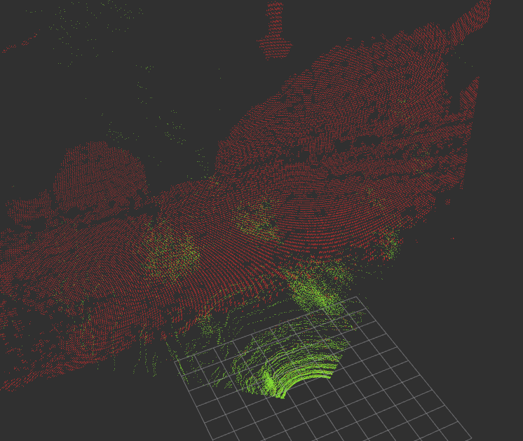

40

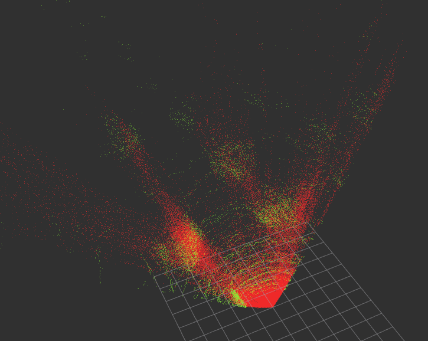

0

# 04.07.2025

Satranç tahtası şeklindeki sentetik veri kullanılarak algoritmanın çalıştığı doğrulandı. Aşağıdaki gibi sonuçlar elde
edildi. İsmail hoca sonuçların gayet iyi olduğunu söyledi. Benzer görüntünün gerçek veri ile elde edilememesinin
sebebinin ZED kamera ile VLP Lidarın FOV kesişimlerinin PG FOV olarak kullanılmamamsı olabileveğini söyledi.

ZED:

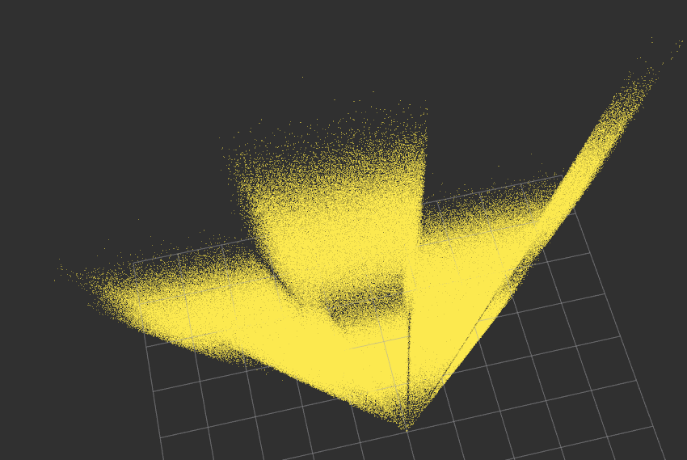

VLP:

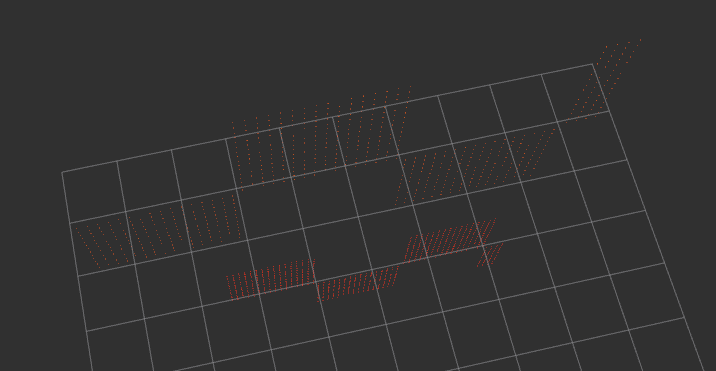

PG:

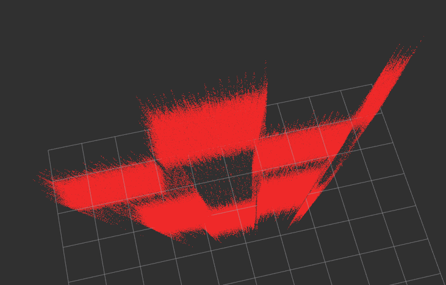

# 07.07.2025

- Önce yüzey düzlemlerinin bulunduğu ve bu düzlemlerin eksenlerine uygun olarak PG'nin işlendiği bir yapı kurulabilir.
  Bu sayede yakınsama daha iyi olacaktır. Örnek vermek gerekirse zemin yüzeyi her zaman kameraya dik olduğu için bu
  alanlarda yakınsama yapmak çok da mümkün olmayabilir. Halbuki önerilen yöntem ile doğru düzlemde PG uygulanabilir.
  Bunun uygulanması tamamen paralel olabilecektir.

- Bir diğer öneri ise derinlik imajı alınmadan önce bir önişleme olarak kamera yatay ekseninde tüm nokta kümelerinin
  rotasyona uyratılması. Bu şekilde zemin yüzeyi noktalarının derinlik imajında daha geniş bir alana projekt etmesi
  sağlanacaktır.

  > :warning: Bu yapılırken overlap olacak noktalara dikkat edilmelidir.

## PG parametre ayarları

Farklı frekans değerleri için elde edilen görüntüler aşağıdaki tabloda verilmiştir.

| Cutoff (Normalized) | Iterations | Image                                          |
|---------------------|------------|------------------------------------------------|
| 0.01                | 100        | 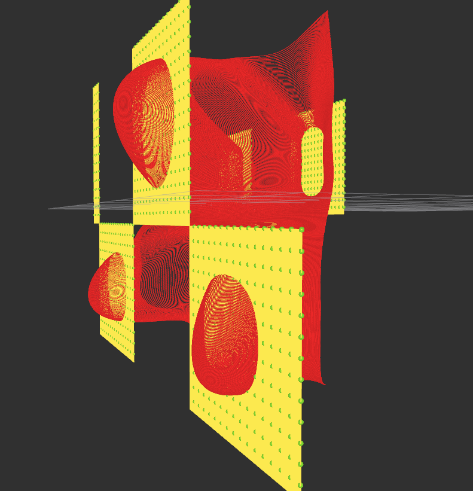 |
| 0.02                | 100        | 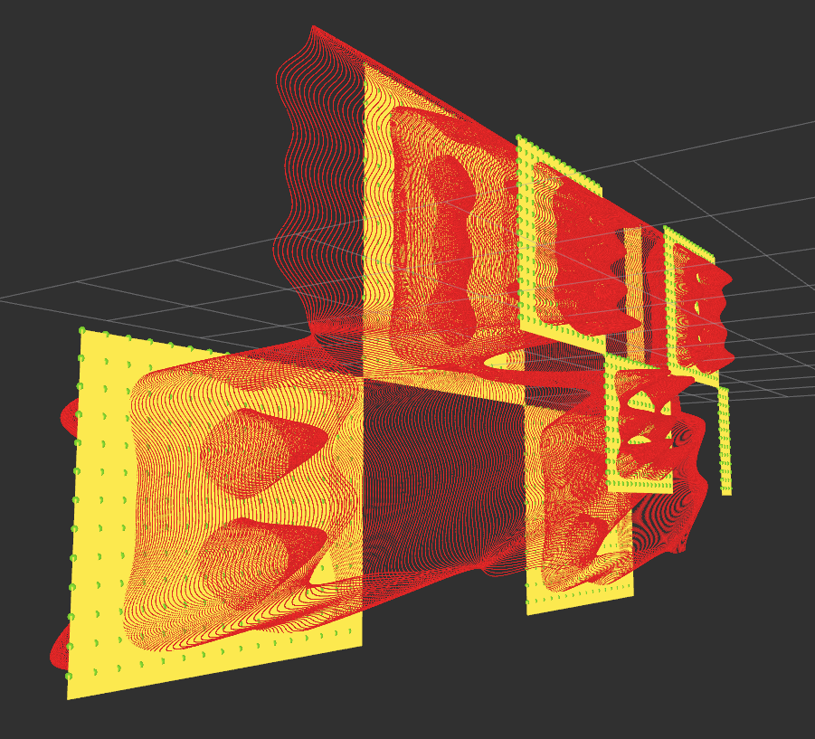 |
| 0.04                | 100        | 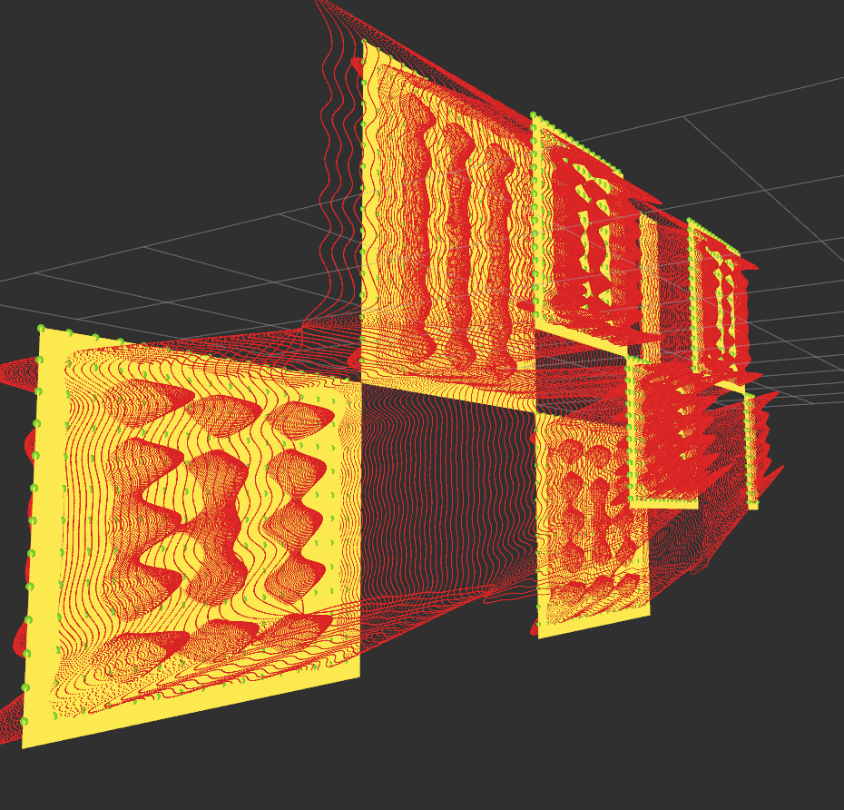 |
| 0.08                | 100        | 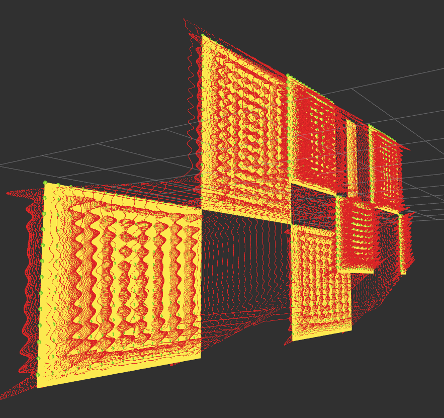 |
| 0.16                | 100        | 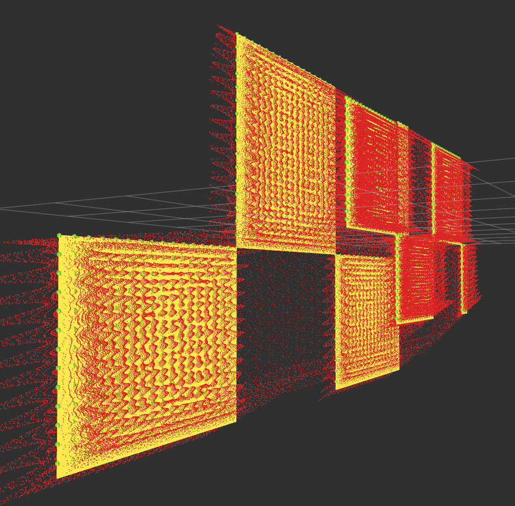 |

## VLP upsamling ile ilgili problem

Sensörlerin anlık olarak göremediği ancak historical olarak tutulan VLP verisinde olan ve aslında gölgelenmiş olması
gereken bir takım noktalar ortaya çıkıyor. Bu da algoritmanın ZED noktalarını bu uzak noktalara yakınsamaya calısmasına
sebep oluyor. Yakınsanmaya çalışılan ZED ve VLP noktaları birbirinden çok uzaklaştığı için low-pass etkiye maruz
kaldıklarında orijine kadar uzanan spike gibi bir geometri ortaya çıkıyor.

Çözüm önerileri:

- Band-reject filtre denenebilir

# 10.07.2025

Jump problemini gidermek icin ZED frame ile VLP frame arasında bir covariance matrix çıkartılarak yüksek varyanslı lidar
noktaları düzeltme için kullanılmayabilir. Nihayetinde ZED frame iyileştirilmeye çalışıldığı ve zorla güzellik
olmayacağı için elden geldiği kadar yapmak daha yerinde olabilir.

Yukarıdakı öneri sonrası çıktı:

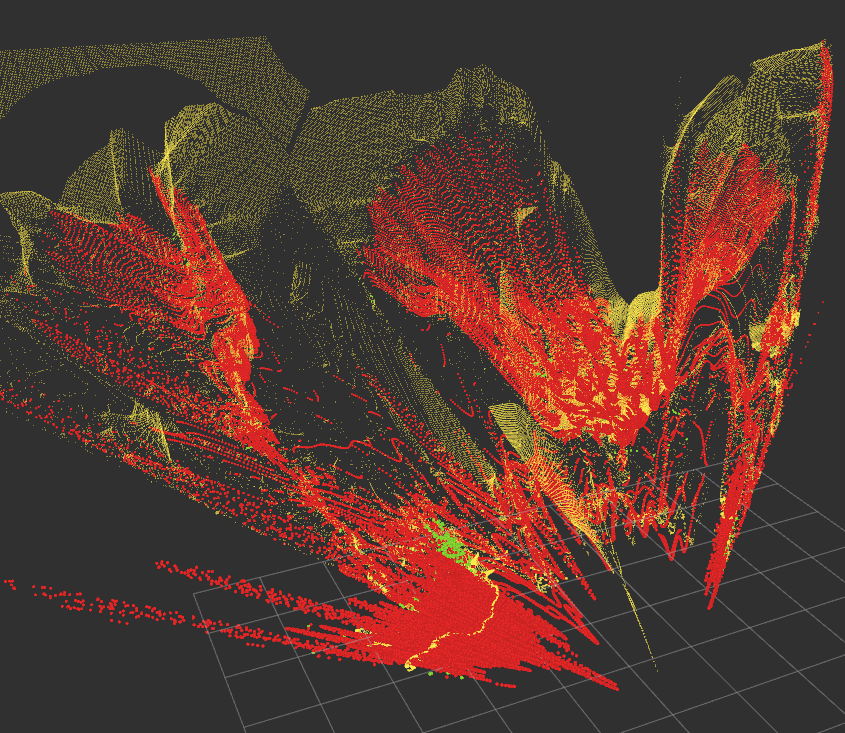
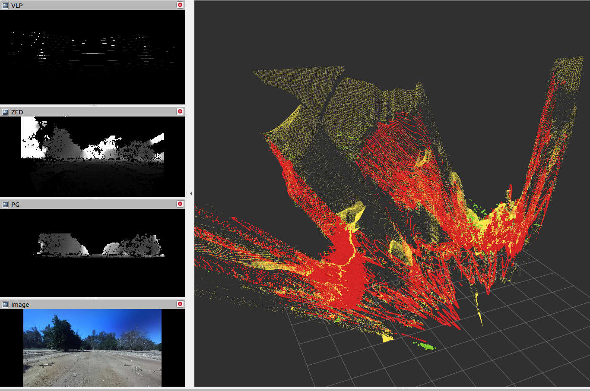

> :note: Bu çıktı teoridekine uygun olarak spike'ları azaltmış oldu.

İyileşmelere rağmen hala küçük spike'lar mevcut. Bunları da gidermek için ne yapılması gerektiği tartışılabilir.

İmajların kare olmaması LPF fonsiyonu circle çizerek çalıştığı için probleme sebep oluyor. Ya imajlar kare olmalı ya da
elips maske denenmeli.

> Elips maske deneyince dikdortgen ve kare imajlar arasındaki fark ortadan kalktı

# 17.07.2025

Varsayılan Brick-wall LPF yerine Gaussian ve Butterworth filtreler denendi. Sonuçlar oldukça iyi. Aşağıdaki raporda
görseller mevcut.

| Cutoff (Normalized) | Iterations | Type        | Image                                                                           |
|---------------------|------------|-------------|---------------------------------------------------------------------------------|
| 0.64                | 2000       | Gaussian    | 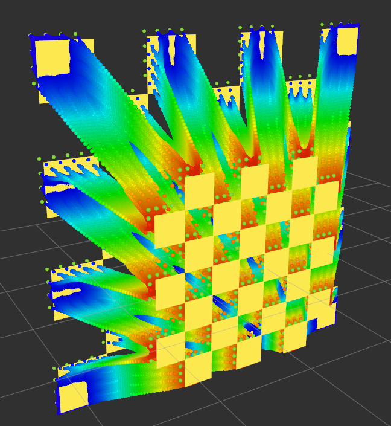       |
| 0.64                | 2000       | Butterworth | 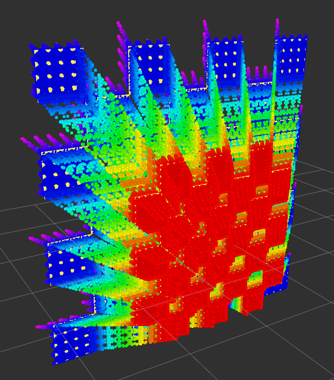 |
| 0.64                | 2000       | Brick-wall  | 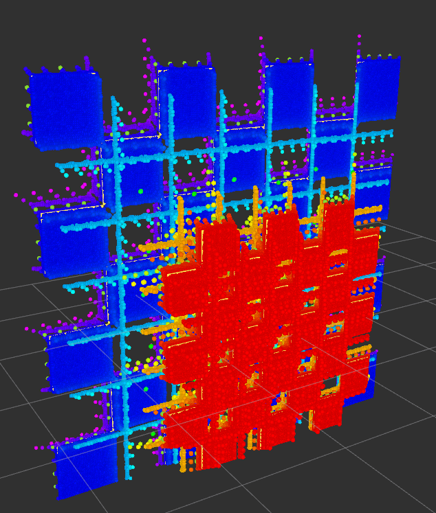   |

Gökkuşağı şeklinde görünen PG çıktısı görüldüğü üzere VLP'ye yakınlaşmıştır. Aynı zamanda iyileşme de net bir şekilde
görülmektedir. Beyaz renk ZED, kırmızı renk VLP verilerine aittir.

- `ncutoff`: 0.16
- `threshold`: 33
- `vlp_zed_diff_max`: 50.0

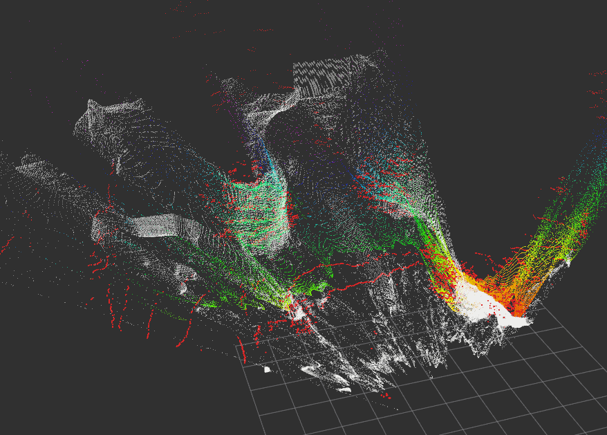

> :warning: Bu yöntemde zeminin çok bozulduğunu fark ettim. Buna bir çözüm bulmak şart gibi. Aklıma ilk gelen zaten
> zeminde yoğün olan VLP verisini kullanmak.

# 19.07.2025

Artık gözle görülür bir iyileşme olduğu için [CitrusFarmDataset](https://ucr-robotics.github.io/Citrus-Farm-Dataset/)'in
GT odometry topic'ini kullanarak bir kıyas yapmam gerektiğine karar verdim. Burada yol haritası olarak danışman hocamla
konuşmadan önce aklıma gelenleri aşağıda sırasıyla listeledim:

1. GT odometry topic incelenmeli ve VLP upsamling için kullanılan odom ile farkının grafiği çıkartılmalı. (
   bkz. https://openaccess.thecvf.com/content_cvpr_2017/papers/Tateno_CNN-SLAM_Real-Time_Dense_CVPR_2017_paper.pdf,
   tablo "(A) Comparison on Pose Trajectory Accuracy")
2. PG odom topic'e basılacak odom bilgisini üretmek için **State-of-the-Art** "Depth Map SLAM" paper'ları incelenmeli ve
   buralarda propose edilen yöntemlerin ZED depth ve PG depth kullanıldığı durumlardaki çıktıları (ve whell odom ile) 1.
   maddedeki gibi plot edilmeli.

Bahsi geçen iki madde yapıldığında bir paper çıkarmış gibi geliyor. Hoca onaylarsa önce bu şekilde bir paper çıkartıp
daha sonra da kendi verisetimizi oluşturarak bir paper çıkartabiliriz diye düşünüyorum.

Outdoor SLAM papers:

- [H. Teng, Y. Wang, X. Song and K. Karydis, “Multimodal Dataset for Localization, Mapping and Crop Monitoring in Citrus Tree Farms”, In International Symposium on Visual Computing (ISVC 2023),
  **page588**](https://link.springer.com/chapter/10.1007/978-3-031-47969-4_44)
- [Outdoor RGB-D Mapping Using Intel-RealSense](https://ieeexplore.ieee.org/document/8956916)
- [Work-is-Playing](https://grauonline.de/wordpress/?page_id=1282)
- [ARDUMOWER VISION / TANGOANYWHERE – CAMERA-BASED POSITION ESTIMATION USING A GOOGLE TANGO PHONE](https://grauonline.de/wordpress/?page_id=2109)
- [RTABMap](https://introlab.github.io/rtabmap/)

# 23.07.2025

Hocayla görüşmeye geldim. Beklerken yaptığım araştırmalar:

- https://dsp.stackexchange.com/questions/46014/gaussian-filter-as-a-low-pass-filter
- [Paper için yapılabilecek deneyler (ChatGPT Export)](./docs/ChatGPT-LiDAR_stereo_fusion_experiments.md)
- [Paper için yapılabilecek deneyler (ChatGPT Link)](https://chatgpt.com/share/688094a5-81c0-8007-aaf7-6c918f763265)

Görüşme sonrası notlar:

- Frame bazında karşılaştırma yapma dedi.
- Geriye kalanlar planladığım gibi.

# 25.07.2025

`inpaint` metodu CUDA kütüphanelerini kullanacak şekilde değiştirildi.

# 27.07.2025

RTABMap ile ZED kamerayı SLAM yapmaya çalışıyorum. TF topic'i ile uğraştım, oldu gibi ama şimdi de ZED kamera PC'u
rotated görünüyor.

# 28.07.2025

IMU topic'leri 200 Hz olduğu için 50 Hz olan TF topic'i 4 katına çıkmalı.

# 01.08.2025

Stereo verisi ile SLAM yaptırmayı başardım. Bu veride odom'da bir jump problemi var gibiydi ancak harita fena değildi.

```bash
roslaunch rtabmap_launch rtabmap.launch \
 rgb_topic:=/zed2i/zed_node/left/image_rect_color \
 depth_topic:=/zed2i/zed_node/depth/depth_registered \
 camera_info_topic:=/zed2i/zed_node/left/camera_info \
 depth_camera_info_topic:=/zed2i/zed_node/depth/camera_info \
 imu_topic:=/zed2i/zed_node/imu/data \
 odom_topic:=/jackal_velocity_controller/odom \
 frame_id:=zed2i_base_link \
 approx_sync:=true \
 wait_imu_to_init:=true \
 use_sim_time:=true \
 publish_tf:=false \
 rtabmap_args:="--delete_db_on_start"
```

PG çıktısını da RTABMap ile denedim ancak jump problemleri devam etti ve harita daha kötü çıktı. Aslında iyileşmesini
bekliyordum. jump problemini çözdükten sonra tekrar deneme yapacağım.

```bash
roslaunch rtabmap_launch rtabmap.launch \
 rgb_topic:=/zed2i/zed_node/left/image_rect_color \
 depth_topic:=/islam/pg_depth \
 camera_info_topic:=/zed2i/zed_node/left/camera_info \
 depth_camera_info_topic:=/zed2i/zed_node/depth/camera_info \
 imu_topic:=/zed2i/zed_node/imu/data \
 odom_topic:=/jackal_velocity_controller/odom \
 frame_id:=zed2i_base_link \
 approx_sync:=true \
 wait_imu_to_init:=true \
 use_sim_time:=true \
 publish_tf:=false \
 rtabmap_args:="--delete_db_on_start"
```

# 02.08.2025

TF'lerde bir sorun olduğu için RTABMap odom verisinde bir jumping problemi vardı. Sorunun iki kez publish edilen bir TF
frame'i olduğunu düğünüyorum. Bunu düzeltmeye çalışacağım.

Aşağıdaki gibi yapınca düzeldi. `publish_tf_odom:=false` argümanını ekledim.

```bash
roslaunch rtabmap_launch rtabmap.launch \
 rgb_topic:=/zed2i/zed_node/left/image_rect_color \
 depth_topic:=/islam/pg_depth \
 camera_info_topic:=/zed2i/zed_node/left/camera_info \
 depth_camera_info_topic:=/zed2i/zed_node/depth/camera_info \
 imu_topic:=/zed2i/zed_node/imu/data \
 odom_topic:=/jackal_velocity_controller/odom \
 frame_id:=zed2i_base_link \
 approx_sync:=true \
 wait_imu_to_init:=true \
 use_sim_time:=true \
 publish_tf:=false \
 publish_tf_odom:=false \
 rtabmap_args:="--delete_db_on_start"
```

```bash
rosrun rqt_tf_tree rqt_tf_tree
```

Öncesi:

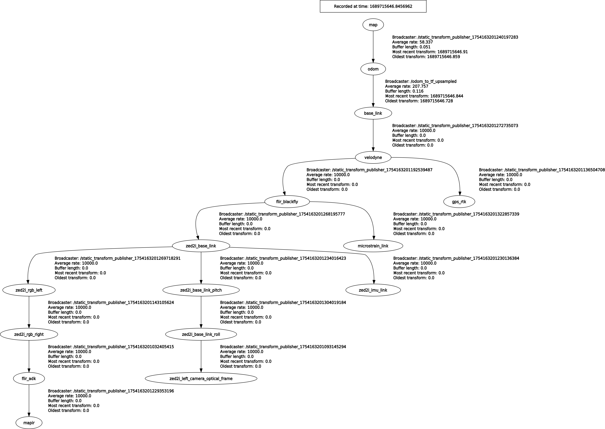

Sonrası:


İyi kötü bir harita çıktı, not olsun diye koyuyorum ancak güncellenmesi lazım.

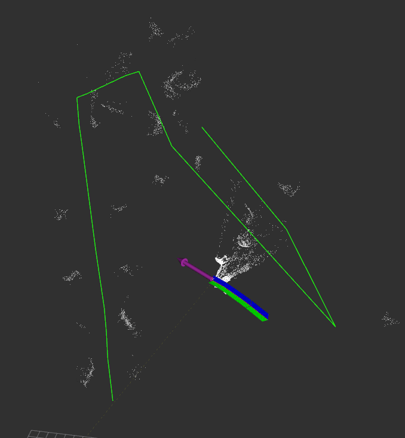

TF problemi çözüldü ve ZED optical frame'de olması gerektiği halde çalıştı. Ancak ham veri olarak gösteriminde rotated
görünüyor. Belki de `frame_id`'yi yanlış veriyorumdur.

# 03.08.2025

Aşağıdaki komutlarla harita çıkardım ve çıktılar yine aşağıdaki şekilde. Anladığım kadarıyla odometry topic verince
RTABMap kendisi etmitation yapmıyor, sadece harita çıkartıyor.

ZED:

```bash
roslaunch rtabmap_launch rtabmap.launch \
 rgb_topic:=/zed2i/zed_node/left/image_rect_color \
 depth_topic:=/zed2i/zed_node/depth/depth_registered \
 camera_info_topic:=/zed2i/zed_node/left/camera_info \
 depth_camera_info_topic:=/zed2i/zed_node/depth/camera_info \
 imu_topic:=/zed2i/zed_node/imu/data \
 frame_id:=base_link \
 approx_sync:=true \
 wait_imu_to_init:=true \
 use_sim_time:=true \
 publish_tf:=false \
 publish_tf_odom:=false \
 publish_tf_map:=false \
 odom_frame_id:=odom \
 rtabmap_args:="--delete_db_on_start"
```

PG:

```bash
roslaunch rtabmap_launch rtabmap.launch \
 rgb_topic:=/zed2i/zed_node/left/image_rect_color \
 depth_topic:=/islam/pg_depth \
 camera_info_topic:=/zed2i/zed_node/left/camera_info \
 depth_camera_info_topic:=/zed2i/zed_node/depth/camera_info \
 imu_topic:=/zed2i/zed_node/imu/data \
 frame_id:=base_link \
 approx_sync:=true \
 wait_imu_to_init:=true \
 use_sim_time:=true \
 publish_tf:=false \
 publish_tf_odom:=false \
 publish_tf_map:=false \
 odom_frame_id:=odom \
 approx_sync_max_interval:=0.02 \
 rtabmap_args:="--delete_db_on_start"
```

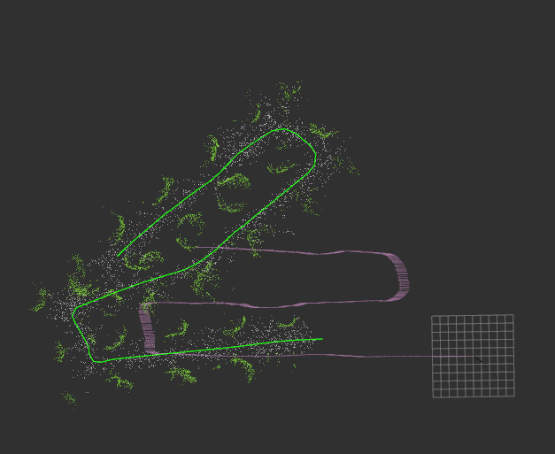
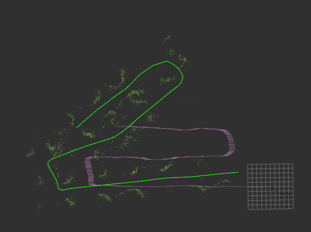

# 04.08.2025

Şimdiki problem odom verisinin wheel encoder ile aynı olması. Böyle olduğu için PG ve ZED performanısı
karşılaştıramıyorum. Bu problemi çözmeye çalışıyorum.

`namespace` kavramını öğrendim. Bu sayede farklı RTABMap instance'ları farklı ROS2 topic isimleri alabiliyor ve çakışma
olmuyor.

# 09.08.2025

Artık aynı odom verisini üretmeyen RTABMap komutları yazmaya çalışacağım. Sonra çıktıları kıyaslayabilirim.

Refs:

- https://docs.ros.org/en/melodic/api/robot_localization/html/index.html
- RTAB-Map Presentation: https://introlab.3it.usherbrooke.ca/images/3/31/Labbe2015ULaval.pdf
- RTAB-Map ROS: http://wiki.ros.org/rtabmap_ros/noetic_and_newer
- RTAB-Map RDB-D mapping paper: https://introlab.3it.usherbrooke.ca/images/e/eb/Labbe14-IROS.pdf

En son yaptığım testlerde RTAB-Map RGB-D odom çıktısının aslında olduğunu ama "Not enough inlier" probleminden dolayı
kesildiğini anladım. Problem ZED kamera ile yaptığım denemelerde dönme esasında peydah oluyordu. Bu problemi çözmek için
Chat GPT-5 ile muhabbet ettim ve bana dönerken olmasının klasik olduğunu söyledi. RTAB-Map parametreleri ile oynayarak
bu problemi çözebileceğimi açıkladı.

ChatGPT export: [Explain_RTAB-Map_command](./docs/ChatGPT-Explain_RTAB-Map_command.md)

```bash
ROS_NAMESPACE=zed roslaunch rtabmap_launch rtabmap.launch \
 rgb_topic:=/zed2i/zed_node/left/image_rect_color \
 depth_topic:=/zed2i/zed_node/depth/depth_registered \
 camera_info_topic:=/zed2i/zed_node/left/camera_info \
 depth_camera_info_topic:=/zed2i/zed_node/depth/camera_info \
 imu_topic:=/zed2i/zed_node/imu/data \
 frame_id:=base_link \
 approx_sync:=true \
 wait_imu_to_init:=true \
 use_sim_time:=true \
 publish_tf:=false \
 publish_tf_odom:=false \
 publish_tf_map:=false \
 odom_frame_id:=odom \
 subscribe_odom:=false \
 approx_sync_max_interval:=0.05 \
 rtabmap_args:="--delete_db_on_start --database_path=/tmp/zed_raw.db \
                --Odom/MinInliers 10 \
                --OdomF2M/KeyFrameThr 0.3"
```

Yukaridaki komut ile denediğimde aşağıdaki gibi odom çıktısı aldım:

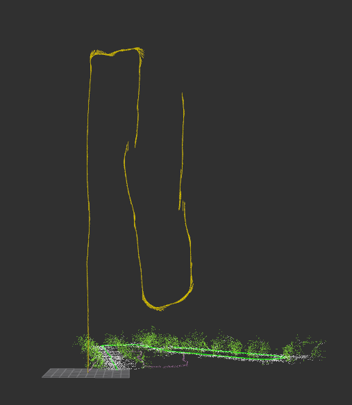

# 17.08.2025

Ayni RTAB-Map denemelerini PG ile denediğimde zamanlama ile ilgili hatalar alıyorum. İncelediğimde gördüğüm kadarıyla PG
çıksıtı oluşana kadar geçen süre header'lara iyiyansımıyor gibi. Bunun üzerine gideceğim.

# 19.08.2025

Her seferinde çalışan konfigürasyonu buldum. ROS bag replay hızı `0.5` olunca ve açağıdaki komutla çalıştırınca
sorun olmuyor:

```bash
ROS_NAMESPACE=zed roslaunch rtabmap_launch rtabmap.launch \
 rgb_topic:=/zed2i/zed_node/left/image_rect_color \
 depth_topic:=/zed2i/zed_node/depth/depth_registered \
 camera_info_topic:=/zed2i/zed_node/left/camera_info \
 depth_camera_info_topic:=/zed2i/zed_node/depth/camera_info \
 imu_topic:=/zed2i/zed_node/imu/data \
 frame_id:=base_link \
 approx_sync:=true \
 wait_imu_to_init:=true \
 use_sim_time:=true \
 publish_tf:=false \
 publish_tf_odom:=false \
 publish_tf_map:=false \
 odom_frame_id:=odom \
 subscribe_odom:=false \
 approx_sync_max_interval:=0.05 \
 rtabmap_args:="--delete_db_on_start --database_path=/tmp/zed_raw.db \
                 --Odom/Strategy 1 \
                 --OdomF2M/KeyFrameThr 0.3 \
                 --Vis/FeatureType 2 \
                 --Vis/MaxFeatures 2000 \
                 --Vis/CorNNDR 0.7 \
                 --Odom/MinInliers 10"
```

# 20.08.2025

Bugün kayıtlar aldım ve ZED ve PG için RTAB-Map çıktılarını karşılaştırdım. Açağıdaki GIF'te görüldüğü gibi PG çıktısı
daha iyi bir sonuç verdi.

```bash
./compare_tf.sh
```


# 22.08.2025

Engebeli arazilerde Lidar sallanacağından taradığı alan FOV olarak artacaktır çünkü historical bir gözlem yapılıyor (
lidar_upsample)

# 24.08.2025

`evo` kullanarak karşılaştırmaları yaptırdım. Sonuçlar iyi duruyor.


