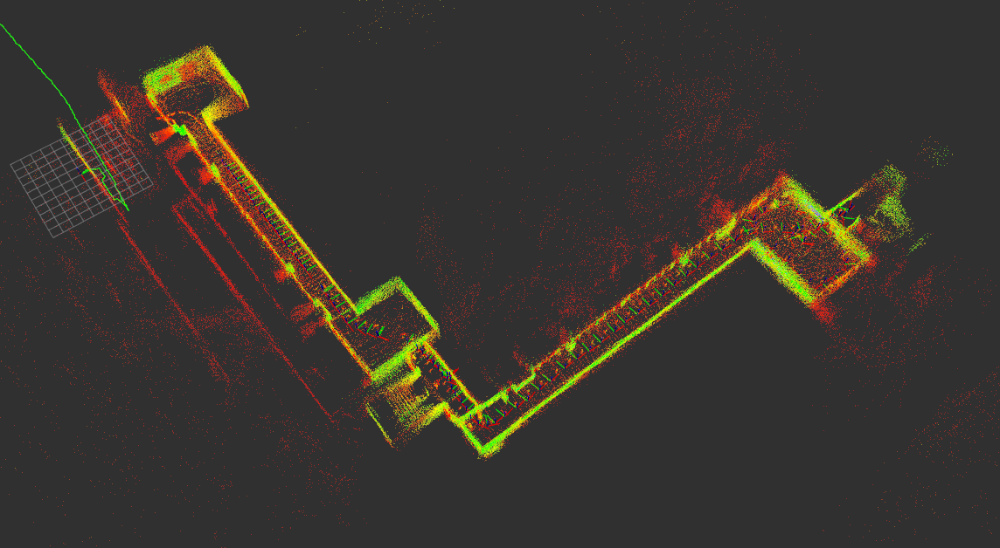
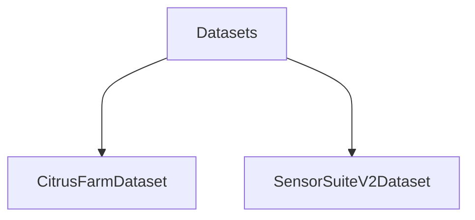

# LIDAR Upsample



Current dependencies:

- ROS Noetic
- Ubuntu 20.04
- Python 3.8.10

Hardware:

- Velodyne VLP-16
- StereoLabs ZED2i

## Bags

The bag files are collected from two different datasets with similar ROS topics. One of them is CitrusFarm and
the other one is SensorSuiteV2 dataset.



- [2024-10-01-19-26-26.bag](../../DS/2024-10-01-19-26-26.bag)
- [2023-05-08-20-25-52.bag](../../DS/2023-05-08-20-25-52.bag)

## Run

```bash
roscore
```

### SensorSuiteV2 Dataset

```bash
source /opt/ros/noetic/setup.bash
rosbag play /home/joseph/Development/DS/2023-05-08-20-25-52.bag -l
```

```bash
rosbag play /home/joseph/Development/DS/2023-05-08-20-25-52.bag -l -s 55 --rate 0.1
```

### CitrusFarm Dataset

# https://ucr-robotics.github.io/Citrus-Farm-Dataset/calibration.html

| Parent Frame    | Child Frame     | x[m]    | y[m]    | z[m]    | qx     | qy      | qz      | qw      |
|-----------------|-----------------|---------|---------|---------|--------|---------|---------|---------|
| base_link       | velodyne        | 0.0400  | 0.0000  | 0.3787  | 0.0000 | 0.0000  | 0.0000  | 1.0000  |
| velodyne        | gps_rtk         | -0.2200 | 0.0000  | 0.1530  | 0.0000 | 0.0000  | 0.0000  | 1.0000  |
| velodyne        | flir_blackfly   | 0.2178  | 0.0049  | -0.0645 | 0.5076 | -0.4989 | 0.4960  | -0.4974 |
| flir_blackfly   | microstrain_imu | -0.0061 | 0.0157  | -0.1895 | 0.4987 | 0.5050  | -0.4987 | 0.4977  |
| flir_blackfly   | zed2i_rgb_left  | -0.0663 | 0.0956  | -0.0161 | 0.0020 | -0.0081 | 0.0031  | 1.0000  |
| zed2i_rgb_left  | zed2i_rgb_right | 0.1198  | -0.0003 | -0.0046 | 0.0013 | 0.0013  | 0.0000  | 1.0000  |
| zed2i_rgb_right | flir_adk        | 0.0251  | -0.0948 | -0.0203 | 0.0026 | -0.0032 | 0.0059  | 1.0000  |
| flir_adk        | mapir           | -0.1608 | -0.0046 | -0.0138 | 0.0028 | 0.0186  | -0.0094 | 0.9998  |

> :info: `--clock` flag is passed to be able to use the simulation time on the ros nodes. Otherwise, the
`ApproximateTimeSynchronizer` could not work fine when rosbag restarts

```bash
rosbag play -l -s 10 -u 10 --clock \
~/Development/DS/Citrus-Farm-Dataset/01_13B_Jackal/base_2023-07-18-14-26-48_0.bag \
~/Development/DS/Citrus-Farm-Dataset/01_13B_Jackal/zed_2023-07-18-14-26-49_0.bag \
~/Development/DS/Citrus-Farm-Dataset/01_13B_Jackal/odom_2023-07-18-14-26-48.bag
```

> :warning: To make all the topics synchronized, we have to make the reply rate 0.1 (etc.). Otherwise, there will be
> delay between some topics.

```bash
rosbag play -l -s 10 -u 10 -r 0.1 --clock \
~/Development/DS/Citrus-Farm-Dataset/01_13B_Jackal/base_2023-07-18-14-26-48_0.bag \
~/Development/DS/Citrus-Farm-Dataset/01_13B_Jackal/zed_2023-07-18-14-26-49_0.bag \
~/Development/DS/Citrus-Farm-Dataset/01_13B_Jackal/odom_2023-07-18-14-26-48.bag
```

## Run Topic Transformer

```bash
./transformer_lidar.sh
```

## Run Algorithm

```bash
source /opt/ros/noetic/setup.bash
python3 lidar_upsample.py
```

```bash
source /opt/ros/noetic/setup.bash
python3 meas_topic_stats.py
```

```bash
cd /home/joseph/PycharmProjects/citrusFarmSFITC/
python3 main.py
```

## RViz

```bash
source /opt/ros/noetic/setup.bash
rviz -d /media/joseph/Development/GitHub/lidar_upsample/rviz.rviz
```

# RTABMap

> :warning: GT olmadan bag oynat!

```bash
rosbag play -s 0 -u 20 -r 1.0 --clock \
~/Development/DS/Citrus-Farm-Dataset/01_13B_Jackal/base_2023-07-18-14-26-48_0.bag \
~/Development/DS/Citrus-Farm-Dataset/01_13B_Jackal/zed_2023-07-18-14-26-49_0.bag \
~/Development/DS/Citrus-Farm-Dataset/01_13B_Jackal/odom_2023-07-18-14-26-48.bag
```

ZED:

```bash
rosrun tf static_transform_publisher 0 0 0 0 0 0 map odom 100
python3 odom_to_tf.py
#rosrun tf static_transform_publisher 0 0 0 0 0 0 odom base_link 100
rosrun tf2_ros static_transform_publisher 0 0 0.1 0 0 0 base_link zed2i_left_camera_optical_frame
rosrun tf2_ros static_transform_publisher 0 0 0.1 0 0 0 base_link zed2i_base_link
rosrun tf2_ros static_transform_publisher 0 0 0.1 0 0 0 zed2i_base_link zed2i_imu_link
```

https://medium.com/@basilshaji32/zed2i-vslam-setup-with-rtab-map-using-ros2-a16083630b86

```bash
roslaunch rtabmap_launch rtabmap.launch \
 rgb_topic:=/zed2i/zed_node/left/image_rect_color \
 depth_topic:=/zed2i/zed_node/depth/depth_registered \
 camera_info_topic:=/zed2i/zed_node/left/camera_info \
 depth_camera_info_topic:=/zed2i/zed_node/depth/camera_info \
 imu_topic:=/zed2i/zed_node/imu/data \
 frame_id:=zed2i_base_link \
 approx_sync:=true \
 wait_imu_to_init:=true \
 use_sim_time:=true
```